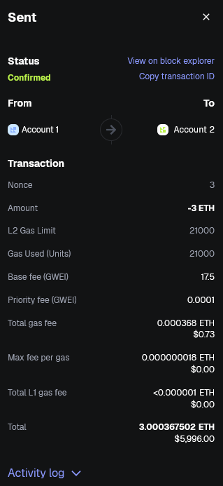
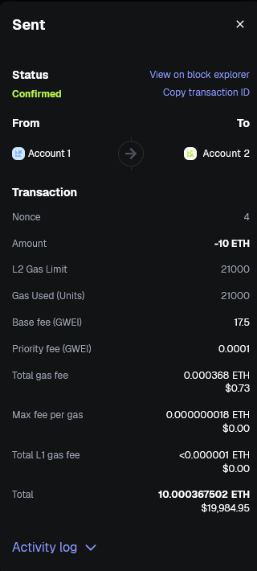

## 1. Wallet

**Metamask Account Address:**
`0xB5440Fb308149BAACe327Bc714c6A9d8F2Bd394E`

## 2. Chains

**Incoming Transaction Link:**
`0xf26157cc1bdfa8125ad11d1d88b837451de89bc5556fe99d5ad79f5cc8a080ef`

## 3. Transactions

**Transfer Transaction Link:**
`https://sepolia.mantlescan.xyz/tx/0x5c97c04c7956c32fd3b996a993444dba01646a8ff8b23932cbbe6e062f31d514`

## 4. Gas

**Mainnet Gas Tracker:**
`https://mantlescan.xyz/gastracker#gasguzzler`

**Testnet Gas Tracker:**
-

## 5. Nonce

**Transaction 1 Link (incremented nonce):**
`https://sepolia.mantlescan.xyz/tx/0x920884469d1a1c49744b2b5f0c7b00a495e5f5db4e3db6e1ec25e2319a6ff092`

**Transaction 2 Link (default nonce):**
`https://sepolia.mantlescan.xyz/tx/0x0f800db187d36cbdfb8c9da243c74c6845da40cbbf6f545a7b680f2ffd1b4323`

**Transaction 1 Activity Log:**

**Transaction 2 Activity Log:**
